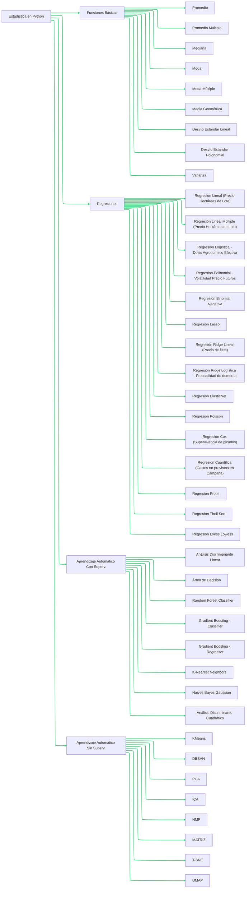

           

# Índice del Repositorio

```mermaid
%%{init: {"flowchart": {"defaultRenderer": "elk"}} }%%
graph LR
  DU["Estadística en Python"]
  DU --> G1["Funciones Básicas"]
  DU --> G2["Regresiones"]
  DU --> G3["Aprendizaje Automatico Con Superv."]
  DU --> G4["Aprendizaje Automatico Sin Superv."]
  G1 --> C1["Promedio"]
  G1 --> C2["Promedio Multiple"]
  G1 --> C3["Mediana"]
  G1 --> C4["Moda"]
  G1 --> C5["Moda Múltiple"]
  G1 --> C6["Media Geométrica"]
  G1 --> C7a["Desvío Estandar Lineal"]
  G1 --> C7b["Desvío Estandar Polonomial"]
  G1 --> C8["Varianza"]
  G2 --> D1["Regresion Lineal (Precio Hectáreas de Lote)"]
  G2 --> D2["Regresión Lineal Múltiple (Precio Hectáreas de Lote)"]
  G2 --> D3["Regresion Logística - Dosis Agroquímico Efectiva"]
  G2 --> D4["Regresion Polinomial - Volatilidad Precio Futuros"]
  G2 --> D5["Regresión Binomial Negativa"]
  G2 --> D6["Regresión Lasso"]
  G2 --> D7A["Regresión Ridge Lineal (Precio de flete)"]
  G2 --> D7B["Regresión Ridge Logística - Probabilidad de demoras"]
  G2 --> D8["Regresion ElasticNet"]
  G2 --> D9["Regresion Poisson"]
  G2 --> D10["Regresión Cox (Supervivencia de picudos)"]
  G2 --> D11["Regresión Cuantílica (Gastos no previstos en Campaña)"]
  G2 --> D12["Regresion Probit"]
  G2 --> D13["Regresion Theil Sen"]
  G2 --> D14["Regresion Loess Lowess"]
  G3 --> E1["Análisis Discrimanante Linear"]
  G3 --> E2["Árbol de Decisión"]
  G3 --> E3["Random Forest Classifier"]
  G3 --> E4["Gradient Boosting - Classifier"]
  G3 --> E5["Gradient Boosting - Regressor"]
  G3 --> E6["K-Nearest Neighbors"]
  G3 --> E7["Naives Bayes Gaussian"]
  G3 --> E8["Análisis Discriminante Cuadrático"]
  G4 --> H1["KMeans"]
  G4 --> H2["DBSAN"]
  G4 --> H3["PCA"]
  G4 --> H4["ICA"]
  G4 --> H5["NMF"]
  G4 --> H6["MATRIZ"]
  G4 --> H7["T-SNE"]
  G4 --> H8["UMAP"]
    linkStyle 0 stroke:#2ecd71,stroke-width:2px
    linkStyle 1 stroke:#2ecd71,stroke-width:2px
    linkStyle 2 stroke:#2ecd71,stroke-width:2px
    linkStyle 3 stroke:#2ecd71,stroke-width:2px
    linkStyle 4 stroke:#2ecd71,stroke-width:2px
    linkStyle 5 stroke:#2ecd71,stroke-width:2px
    linkStyle 6 stroke:#2ecd71,stroke-width:2px
    linkStyle 7 stroke:#2ecd71,stroke-width:2px
    linkStyle 8 stroke:#2ecd71,stroke-width:2px
    linkStyle 9 stroke:#2ecd71,stroke-width:2px
    linkStyle 10 stroke:#2ecd71,stroke-width:2px
    linkStyle 11 stroke:#2ecd71,stroke-width:2px
    linkStyle 12 stroke:#2ecd71,stroke-width:2px
    linkStyle 13 stroke:#2ecd71,stroke-width:2px
    linkStyle 14 stroke:#2ecd71,stroke-width:2px
    linkStyle 15 stroke:#2ecd71,stroke-width:2px
    linkStyle 16 stroke:#2ecd71,stroke-width:2px
    linkStyle 17 stroke:#2ecd71,stroke-width:2px
    linkStyle 18 stroke:#2ecd71,stroke-width:2px
    linkStyle 19 stroke:#2ecd71,stroke-width:2px
    linkStyle 20 stroke:#2ecd71,stroke-width:2px
    linkStyle 21 stroke:#2ecd71,stroke-width:2px
    linkStyle 22 stroke:#2ecd71,stroke-width:2px
    linkStyle 23 stroke:#2ecd71,stroke-width:2px
    linkStyle 24 stroke:#2ecd71,stroke-width:2px
    linkStyle 25 stroke:#2ecd71,stroke-width:2px
    linkStyle 26 stroke:#2ecd71,stroke-width:2px
    linkStyle 27 stroke:#2ecd71,stroke-width:2px
    linkStyle 28 stroke:#2ecd71,stroke-width:2px
    linkStyle 29 stroke:#2ecd71,stroke-width:2px
    linkStyle 30 stroke:#2ecd71,stroke-width:2px
    linkStyle 31 stroke:#2ecd71,stroke-width:2px
    linkStyle 32 stroke:#2ecd71,stroke-width:2px
    linkStyle 33 stroke:#2ecd71,stroke-width:2px
    linkStyle 34 stroke:#2ecd71,stroke-width:2px
    linkStyle 35 stroke:#2ecd71,stroke-width:2px
    linkStyle 36 stroke:#2ecd71,stroke-width:2px
    linkStyle 37 stroke:#2ecd71,stroke-width:2px
    linkStyle 38 stroke:#2ecd71,stroke-width:2px
    linkStyle 39 stroke:#2ecd71,stroke-width:2px
    linkStyle 40 stroke:#2ecd71,stroke-width:2px
    linkStyle 41 stroke:#2ecd71,stroke-width:2px
    linkStyle 42 stroke:#2ecd71,stroke-width:2px
    linkStyle 43 stroke:#2ecd71,stroke-width:2px

    click C1 "https://github.com/MaturusLux/estadisticas_python/blob/main/funciones_basicas/01_basico_promedio_rinde.py" "Media Aritmética"
    click C2 "https://github.com/MaturusLux/estadisticas_python/blob/main/funciones_basicas/02_basico_promedio_movil.py" "Media Aritmética Múltiple"
    click C3 "https://github.com/MaturusLux/estadisticas_python/blob/main/funciones_basicas/03_basico_mediana.py" "Mediana"
    click C4 "https://github.com/MaturusLux/estadisticas_python/blob/main/funciones_basicas/04_moda.py" "Moda"
    click C5 "https://github.com/MaturusLux/estadisticas_python/blob/main/funciones_basicas/05_multimoda.py" "Moda Multiple"
    click C6 "https://github.com/MaturusLux/estadisticas_python/blob/main/funciones_basicas/06_media_geometrica_vs_aritmetica.py" "Media Geométrica"
    click C7a "https://github.com/MaturusLux/estadisticas_python/blob/main/funciones_basicas/07_desvio_estandar_lineal.py" "Desvío Estandar Lineal"
    click C7b "https://github.com/MaturusLux/estadisticas_python/blob/main/funciones_basicas/07_desvio_estandar_polinomial.py" "Desvío Estandar Polinomial"
    click C8 "https://github.com/MaturusLux/estadisticas_python/blob/main/funciones_basicas/08_varianza_altaBaja_coefVariacion.py" "Varianza"
    click D1 "https://github.com/MaturusLux/estadisticas_python/blob/main/regresiones/01_regresion_lineal_agro.py" "Regresión Lineal"
    click D2 "https://github.com/MaturusLux/estadisticas_python/blob/main/regresiones/02_regresion_lineal_multiple.py" "Regresión Lineal Multiple"
    click D3 "https://github.com/MaturusLux/estadisticas_python/blob/main/regresiones/03_regresion_logistica.py" "Regresión Logística"
    click D4 "https://github.com/MaturusLux/estadisticas_python/blob/main/regresiones/04_regresion_polinomial.py" "Regresión Polinomial"
    click D5 "https://github.com/MaturusLux/estadisticas_python/blob/main/regresiones/05_regresion_binomial_negativa.py" "Regresión Binomial Negativa"
    click D6 "https://github.com/MaturusLux/estadisticas_python/blob/main/regresiones/06_regresionLasso.py" "Regresión Lasso"
    click D7A "https://github.com/MaturusLux/estadisticas_python/blob/main/regresiones/07_regresion_ridge_lineal.py" "Regresión Ridge Lineal"
    click D7B "https://github.com/MaturusLux/estadisticas_python/blob/main/regresiones/07_regresion_ridge_logistica.py" "Regresión Ridge Logística"
    click D8 "https://github.com/MaturusLux/estadisticas_python/blob/main/regresiones/08_regresion_elasticNet.py" "Regresion ElasticNet"
    click D9 "https://github.com/MaturusLux/estadisticas_python/blob/main/regresiones/09_regresion_poisson.py" "Regresion Poisson"
    click D10 "https://github.com/MaturusLux/estadisticas_python/blob/main/regresiones/10_regresion_cox.py" "Regresión Cox"
    click D11 "https://github.com/MaturusLux/estadisticas_python/blob/main/regresiones/11_regresion_cuantilica.py" "Regresión Cuantílica"
    click D12 "https://github.com/MaturusLux/estadisticas_python/blob/main/regresiones/12_regresion_probit.py" "Regresion Probit"
    click D13 "https://github.com/MaturusLux/estadisticas_python/blob/main/regresiones/13_regresion_theil_sen.py" "Regresion Theil Sen"
    click D14 "https://github.com/MaturusLux/estadisticas_python/blob/main/regresiones/14_regresion_loess_lowess.py" "Regresion Loess Lowess"
    click E1 "https://github.com/MaturusLux/estadisticas_python/blob/main/aprendizaje_automatico/01_LinearDiscriminantAnalysis.py" "Análisis Discrimanante Linear"
    click E2 "https://github.com/MaturusLux/estadisticas_python/blob/main/aprendizaje_automatico/02_decision_tree_classifier.py" "Árbol de Decisión"
    click E3 "https://github.com/MaturusLux/estadisticas_python/blob/main/aprendizaje_automatico/03_random_forest_classifier_bagging.py" "Random Forest Classifier"
    click E4 "https://github.com/MaturusLux/estadisticas_python/blob/main/aprendizaje_automatico/04_gradient_boosting_machine_c.py" "Gradient Boosting - Classifier"
    click E5 "https://github.com/MaturusLux/estadisticas_python/blob/main/aprendizaje_automatico/05_gradient_boosting_machine_r.py" "Gradient Boosting - Regressor"
    click E6 "https://github.com/MaturusLux/estadisticas_python/blob/main/aprendizaje_automatico/06_k_nearest_neighbors.py" "K-Nearest Neighbors"
    click E7 "https://github.com/MaturusLux/estadisticas_python/blob/main/aprendizaje_automatico/07_naive_bayes_multinomial.py" "Naives Bayes Gaussian"
    click E8 "https://github.com/MaturusLux/estadisticas_python/blob/main/aprendizaje_automatico/08_quadratic_discriminant_anaysis.py" "Análisis Discriminante Cuadrático"
    click H1 "https://github.com/MaturusLux/estadisticas_python/blob/main/aprendizaje_automatico_NoSupervisado/01_k_means.py" "KMeans"
    click H2 "https://github.com/MaturusLux/estadisticas_python/blob/main/aprendizaje_automatico_NoSupervisado/02_dbscan.py" "DBCSAN"
```
